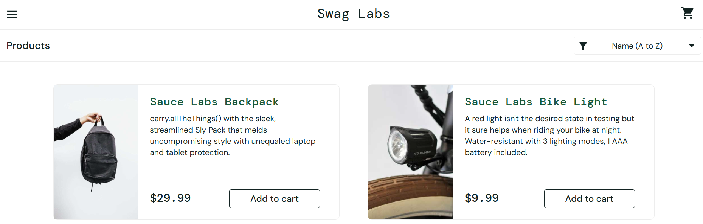
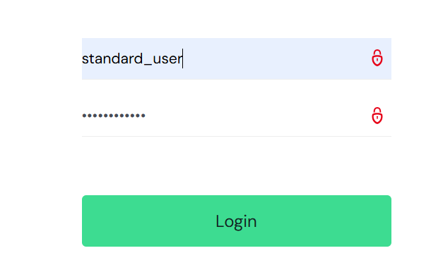
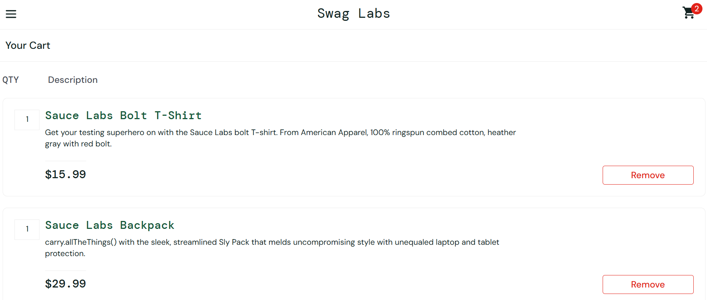
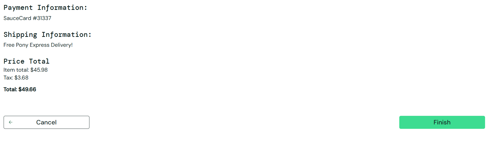
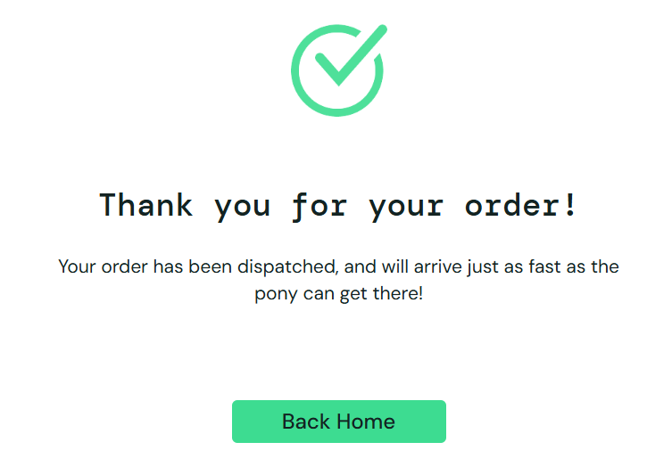

# 🛒 SauceDemo Manual Testing

Manual QA Testing project for the SauceDemo e-commerce web application.

This project demonstrates my practical manual testing skills through test planning, test case design, execution, bug reporting, and professional QA documentation.

---

## 🌐 Portfolio

🔗 https://nijazljevo.github.io/QA-Portfolio/

---

## 📊 Project Summary

- ✅ 32 Test Cases Designed & Executed
- ✅ 5 Modules Tested
- ✅ 100% Test Cases Passed
- ✅ Complete QA Documentation
- ✅ Manual Functional Testing

---

## 📖 Project Overview

The objective of this project was to verify the functionality of the SauceDemo web application by performing manual testing on its core features.

During this project I:

- Designed manual test cases
- Executed functional testing
- Verified application behaviour
- Reported defects
- Created professional QA documentation

---

## 📦 Modules Tested

- Login
- Inventory
- Shopping Cart
- Checkout
- Logout

---

## 🧪 Testing Types

- Manual Testing
- Functional Testing
- UI Testing
- Smoke Testing
- Regression Testing
- Positive Testing
- Negative Testing

---

## 🛠 Tools Used

- Google Chrome
- Microsoft Word
- GitHub
- Jira
- Katalon Studio (Learning)

---

## 📈 Test Results

| Metric | Result |
|---------|--------|
| Test Cases | 32 |
| Modules Tested | 5 |
| Passed | 32 |
| Failed | 0 |
| Critical Bugs | 0 |

---

## 📄 Project Documentation

- 📄 Test Plan
- 📄 Test Cases
- 📄 Test Execution Report
- 📄 Test Summary Report
- 🐞 Bug Report

---

## 💡 Skills Demonstrated

- Test Case Design
- Manual Testing
- Functional Testing
- Test Execution
- Bug Reporting
- QA Documentation
- Defect Reporting
- Git & GitHub

---

## 📸 Application Screenshots

### Login Page

---

### Inventory Page

---

### Shopping Cart

---

### Checkout Overview

---

### Order Complete

---

## 👨‍💻 Author

**Nijaz Ljevo**

Junior QA Engineer

### GitHub

https://github.com/nijazljevo

### Portfolio

https://nijazljevo.github.io/QA-Portfolio/

---

⭐ Thank you for visiting this project.

This project is part of my QA portfolio, where I continuously improve my software testing skills by building practical manual testing projects and creating professional QA documentation.

Feedback and suggestions are always welcome.
